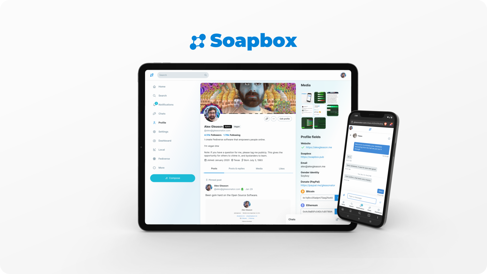

# Unfathomably FE

**Unfathomably FE** is a modern Fediverse frontend derived from Soapbox. It keeps the practical parts that made Soapbox useful for real communities: instance branding, custom navigation, moderation tools, chats, quote posts where the backend supports them, mobile-friendly layouts, and a PWA build that can sit in front of Mastodon-compatible APIs.

This fork is being maintained for the Unfathomably/Rebased family of deployments, including FBXL Social, while preserving compatibility with Pleroma, Akkoma, Mastodon-style, and Rebased-style backends where the API surface allows it.

## Compatibility Notes

Unfathomably FE is the frontend: it owns the browser UI, themes, configuration screens, client-side routes, service worker, and static assets.

The backend owns accounts, timelines, posts, media, federation, moderation APIs, OAuth, ActivityPub endpoints, and server-side policy. Different backends expose different features, so the frontend detects capabilities and only shows supported controls.

Some internal paths and identifiers still use `soapbox` names for compatibility. Examples include `soapbox.json`, `/soapbox/config`, and `useSoapboxConfig`. These names are implementation details, not public branding.

## Development

Use Node 26.3.1 or newer.

```sh
yarn install
yarn start
```

Useful checks:

```sh
npm run lint
npm run i18n:check
npm run check
npm run test:run
npm run build
npm run strict
```

`npm run strict` is the release gate. It runs JavaScript linting, stylesheet linting, i18n validation, TypeScript, Vitest, and a production build with warnings treated as errors.

## Deployment

The built frontend can be served as static files in front of a compatible Fediverse backend. The `installation/` directory contains Nginx examples for Docker and Mastodon-style deployments.

Operators should customize `/instance/soapbox.json` or the admin configuration UI with their own site name, colors, logo, footer links, and policy pages. The software should disappear behind the site's identity in ordinary use.

## Project Philosophy

Unfathomably FE exists to let a Fediverse site look and feel like itself. The frontend should keep backend compatibility, but the public experience should be shaped by the operator's community rather than by a default upstream brand.

That means the fork has two deliberate constraints:

- preserve stable compatibility names where backends, configs, or old deployments depend on them
- present Unfathomably FE, or the operator's configured site identity, to users and outside tooling

## License And Credits

(C) Alex Gleason and other Soapbox contributors
(C) Eugen Rochko and other Mastodon contributors
(C) Trump Media & Technology Group
(C) Gab AI, Inc.

Unfathomably FE is free software: you can redistribute it and/or modify
it under the terms of the GNU Affero General Public License as published by
the Free Software Foundation, either version 3 of the License, or
(at your option) any later version.

Unfathomably FE is distributed in the hope that it will be useful,
but WITHOUT ANY WARRANTY; without even the implied warranty of
MERCHANTABILITY or FITNESS FOR A PARTICULAR PURPOSE. See the
GNU Affero General Public License for more details.

You should have received a copy of the GNU Affero General Public License
along with Unfathomably FE. If not, see <https://www.gnu.org/licenses/>.
