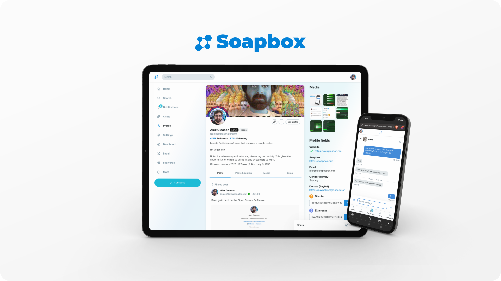

# Unfathomably FE

> Your corner of the Fediverse is the whole thing

**Unfathomably FE** is a modern Fediverse frontend derived from Soapbox. It keeps the practical parts that made Soapbox useful for real communities: instance branding, custom navigation, moderation tools, chats, quote posts where the backend supports them, mobile-friendly layouts, and a PWA build that can sit in front of Mastodon-compatible APIs.

This fork is being maintained for the Unfathomably/Rebased family of deployments while preserving compatibility with Pleroma, Akkoma, Mastodon-style, and Rebased-style backends where the API surface allows it.

## What Makes It Different

Soapbox was built around a Mastodon-compatible social UI with strong instance branding. Unfathomably FE keeps that inheritance, but the fork is aimed at a wider Fediverse shape.

The largest difference is that the UI treats remote things that are not ordinary user profiles as first-class browsing targets:

- **Groups** collect group-like actors such as Lemmy communities, PieFed communities, Mbin magazines, Lotide groups, and PeerTube channels where the backend can expose them.
- **Sources** collect source-like actors such as publishing, media, music, image, and other feed-style accounts that do not fit neatly into a normal profile timeline.
- Group and source previews are designed to show remote posts as actionable status items when the backend has enough information to support replies, comments, likes, shares, and navigation.
- The frontend has dedicated federation tests for native group/source item cards, source item schemas, source previews, and websocket stream behavior.
- Composer draft persistence is kept for crash recovery, but sent posts clear the saved draft and users can discard stale drafts.
- The public brand can be Unfathomably FE, but ordinary sites should be able to use their own configured logo, theme, accent colors, and footer links.

Compared with a plain Pleroma or Rebased frontend deployment, Unfathomably FE expects more of the backend: group/source APIs, richer status metadata, translation capability discovery, websocket streams, and compatibility hints. When those capabilities are absent, the UI should degrade instead of pretending unsupported actions are available.

## Recent Stack Work

Recent work has moved Unfathomably well past a cosmetic frontend fork. The
frontend and the paired backend have both been pushed toward treating the wider
Fediverse as ordinary, navigable site content rather than a set of special
cases.

On the frontend side:

- Groups and Feeds are now day-to-day navigation surfaces, with followed group
  timelines, followed feed timelines, group attribution on statuses, combined
  group/feed discovery search, per-account landing preferences, and feed-type
  filters.
- Remote group and feed previews render closer to normal status cards when the
  backend exposes enough information for replies, likes, boosts, bookmarks,
  quotes, and navigation.
- RSS and Atom subscriptions can appear through the same feed UI as other
  source-like actors, so blogs, libraries, podcasts, channels, and media feeds
  do not need to look like fake user profiles.
- PeerTube and Funkwhale media can keep their in-card presentation while also
  offering a persistent docked player for listening or watching while browsing.
- Thread views, desktop column sizing, profile media revisit behavior, form
  labels, checkbox contrast, and other daily-use details have been tightened up
  so the broader federation work still feels like a normal social interface.
- Streaming and notification paths have been hardened with aggregate
  Groups/Feeds websocket subscriptions, visible-tab reconnects, silent-stall
  recovery, safer push notification formatting, and better handling for grouped
  notification identifiers.
- Translation controls follow backend capability metadata, including
  provider-side source-language detection, slower OpenTranslate requests, and
  unknown-language remote posts.
- The build and release path has been refreshed with current frontend
  dependencies, a stricter ESLint/Vite setup, regenerated locale data, and
  generated release archives kept out of the Git tree.

On the backend side, the sibling
[`unfathomably-be`](https://github.com/fbxl-sj0/unfathomably-be) project has
grown into the other half of the same compatibility push:

- Broad federation smoke coverage now exercises Lemmy, PieFed, Mbin, Lotide,
  PeerTube, NodeBB, Discourse, Friendica, Hubzilla, FediGroups, Mastodon-style,
  Pleroma-style, and Rebased-style behavior where those platforms support the
  relevant operations.
- Group and Threadiverse handling has been expanded around follows, top-level
  group posts, replies, likes, unlikes, deletes, unfollows, local group
  discovery, and moderation fanout.
- Remote discussion hydration, actor refresh jobs, duplicate-fetch collapse,
  stale-data janitors, federation health reporting, and safer prune paths help
  long-running instances deal with remote content without turning every missed
  delivery into permanent local damage.
- Translation, search, media, and archive-portability work now covers
  OpenTranslate-compatible source detection, Meilisearch health and setup,
  media proxy and upload improvements, ActivityPub backup exports, and post
  archive import policy.
- Compatibility backports from Pleroma and related projects have filled in
  Mastodon-style followed hashtags, rule metadata, instance metadata, settings
  storage, websocket behavior, mail handling, upload behavior, ActivityPub actor
  metadata, and other API details that clients expect.
- Misskey-family, NodeBB, Hubzilla, Discourse, Friendica, Funkwhale, PeerTube,
  and Threadiverse quirks are handled as explicit compatibility surfaces rather
  than accidental one-off fixes.

Together, the two repositories are meant to make a small or medium Fediverse
site feel less isolated. Unfathomably FE gives operators a browser interface for
that wider world; unfathomably-be does the federation, policy, search,
translation, cleanup, and compatibility work needed to make those screens
truthful.

## Compatibility Notes

Unfathomably FE is the frontend: it owns the browser UI, themes, configuration screens, client-side routes, service worker, and static assets.

The backend owns accounts, timelines, posts, media, federation, moderation APIs, OAuth, ActivityPub endpoints, and server-side policy. Different backends expose different features, so the frontend detects capabilities and only shows supported controls.

Some internal paths and identifiers still use `soapbox` names for compatibility. Examples include `soapbox.json`, `/soapbox/config`, and `useSoapboxConfig`. These names are implementation details, not public branding.

## Relationship To Soapbox, Rebased, And Pleroma

Unfathomably FE is closest to Soapbox in code structure and user-interface ancestry. It is intended to pair especially well with unfathomably-be, which descends from Rebased and Pleroma.

That means some names remain intentionally historical. Keeping stable config paths and API expectations matters more than renaming every internal symbol. Public-facing names, repository links, default metadata, and operator documentation should refer to Unfathomably FE.

The project is not trying to replace every Fediverse client. It is trying to be a practical web frontend for servers that want Mastodon-style usability plus better day-to-day interaction with group, source, and Threadiverse-style software.

## Development

Use Node 26.3.1 or newer.

```sh
yarn install
yarn start
```

Useful checks:

```sh
npm run lint
npm run i18n:check
npm run check
npm run test:run
npm run build
npm run strict
```

`npm run strict` is the release gate. It runs JavaScript linting, stylesheet linting, i18n validation, TypeScript, Vitest, and a production build with warnings treated as errors.

## Deployment

The built frontend can be served as static files in front of a compatible Fediverse backend. The `installation/` directory contains Nginx examples for Docker and Mastodon-style deployments.

Operators should customize `/instance/soapbox.json` or the admin configuration UI with their own site name, colors, logo, footer links, and policy pages. The software should disappear behind the site's identity in ordinary use.

## Project Philosophy

Unfathomably FE exists to let a Fediverse site look and feel like itself. The frontend should keep backend compatibility, but the public experience should be shaped by the operator's community rather than by a default upstream brand.

That means the fork has two deliberate constraints:

- preserve stable compatibility names where backends, configs, or old deployments depend on them
- present Unfathomably FE, or the operator's configured site identity, to users and outside tooling

## License And Credits

(C) Alex Gleason and other Soapbox contributors
(C) Eugen Rochko and other Mastodon contributors
(C) Trump Media & Technology Group
(C) Gab AI, Inc.

Unfathomably FE is free software: you can redistribute it and/or modify
it under the terms of the GNU Affero General Public License as published by
the Free Software Foundation, either version 3 of the License, or
(at your option) any later version.

Unfathomably FE is distributed in the hope that it will be useful,
but WITHOUT ANY WARRANTY; without even the implied warranty of
MERCHANTABILITY or FITNESS FOR A PARTICULAR PURPOSE. See the
GNU Affero General Public License for more details.

You should have received a copy of the GNU Affero General Public License
along with Unfathomably FE. If not, see <https://www.gnu.org/licenses/>.
